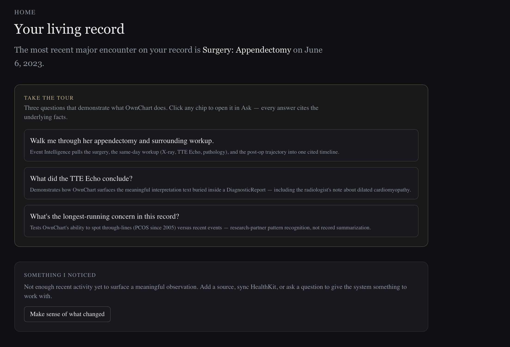
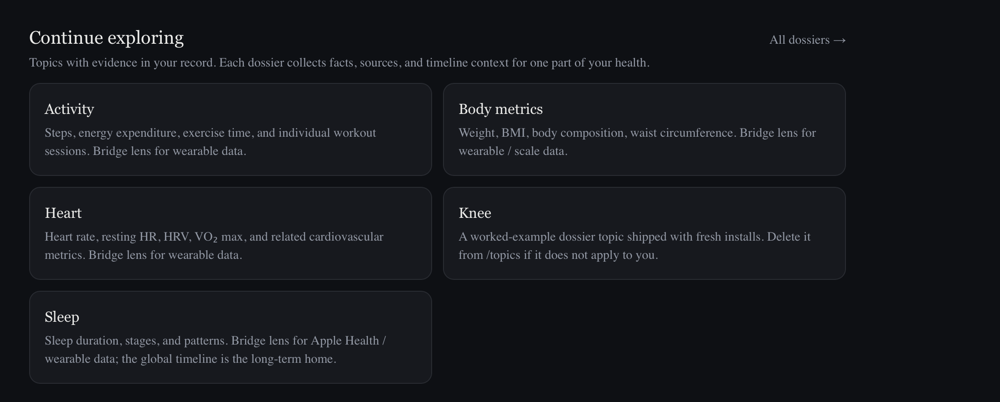
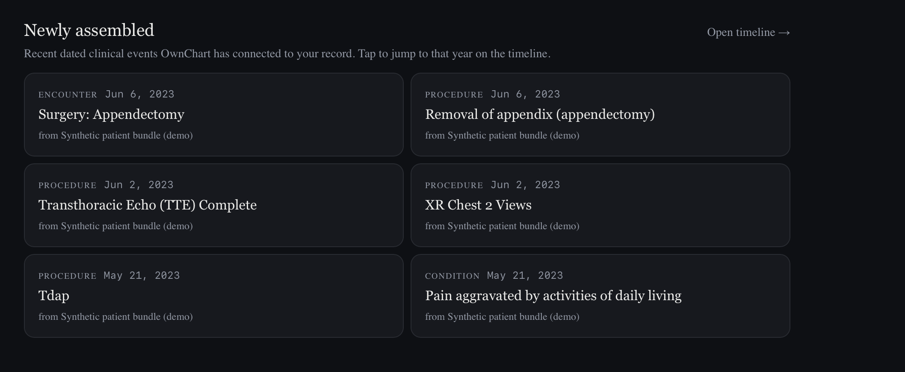
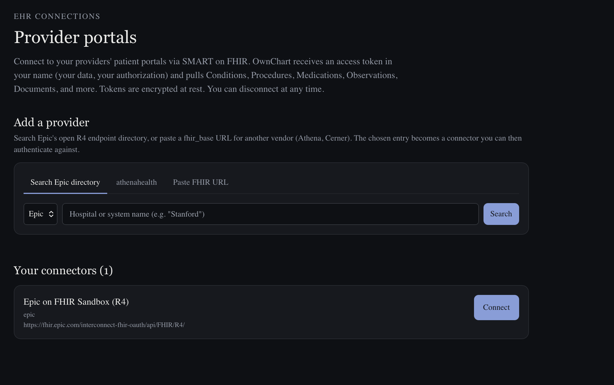
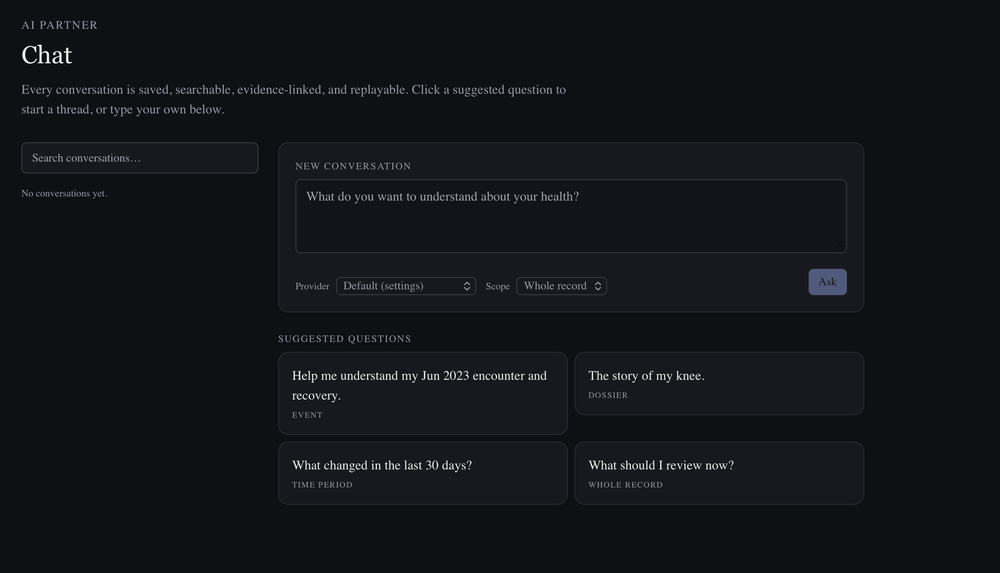
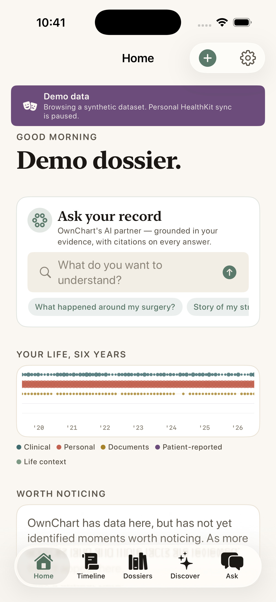
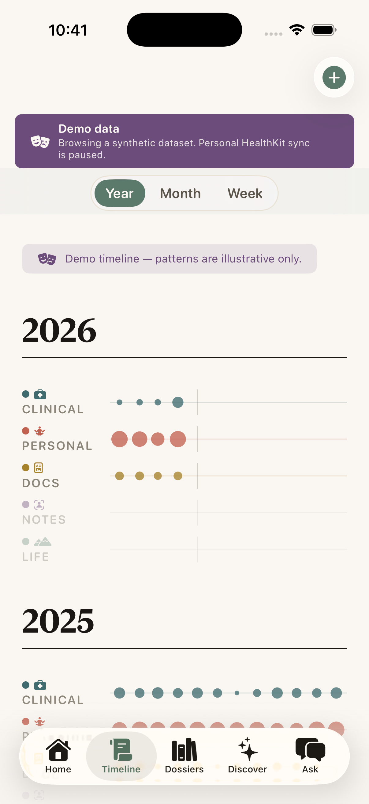
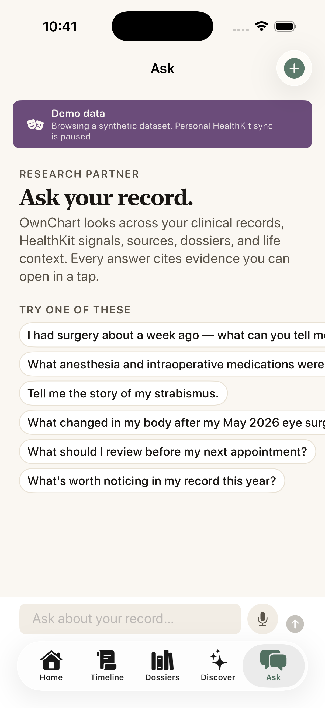
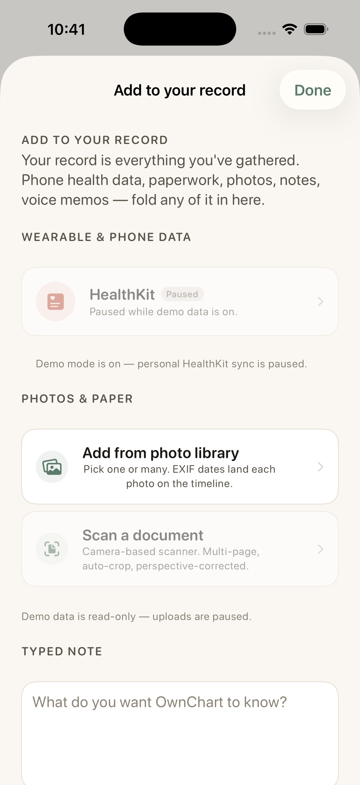

<p align="center">
  
</p>

# OwnChart

**Your life tells the story of your health. OwnChart helps you read it.**

OwnChart is a private, self-hosted AI research partner for your body, your care, and your life. It brings together medical records, wearable data, clinical notes, PDFs, CCDAs, FHIR bundles, photos, voice notes, supplements, workouts, and life events, then lets you ask questions across all of it with citations back to the evidence.

OwnChart is not a patient portal. It is not an EMR clone. It is a patient-owned, person-owned tool for understanding the story your data is already telling.

You own the data. You ask the questions. You stay the authority.

<p align="center">
  
</p>

<p align="center">
  <em>Demo data shown — synthetic patient bundle.</em>
</p>

---

## What can I ask?

OwnChart is built for questions that do not fit inside a single portal, chart note, lab result, or fitness app.

Examples:

- "What happened around my surgery, and how did recovery affect my sleep, HRV, and training?"
- "What happened around the Marine Corps Marathon in 2025?"
- "What changed when I started taking vitamin B?"
- "Tell me the story of my hearing loss over the years."
- "When did my knee problems start showing up in the record?"
- "What did the operative note actually say, in plain English?"
- "Which medications show up in multiple systems, and are any duplicates?"
- "What do my wearable data and calendar suggest about the weeks before this flare?"
- "What should I review before my next appointment?"
- "What does OwnChart know, what is inferred, and what is still missing?"

Healthcare is part of health. It is not the whole thing.

Some people will use OwnChart to understand complex medical histories. Others may rarely see a doctor and use it mostly to understand training, sleep, recovery, supplements, travel, stress, injuries, symptoms, and aging.

---

## Why OwnChart exists

Most of us do not have one health record. We have fragments:

- EHR portals
- FHIR exports
- CCDA documents
- PDFs and faxes
- scanned notes
- radiology reports
- Apple Health / HealthKit data
- workouts
- sleep and HRV
- medications and supplements
- calendars and travel
- photos
- voice notes
- memory

Institutions have systems for storing, coding, billing, and reviewing those fragments. People usually do not.

OwnChart exists to close that gap.

The goal is **personal health parity**: helping a person, caregiver, or family understand their own health and life data with the seriousness, memory, and analytical depth normally reserved for clinicians, researchers, trainers, dietitians, and institutions.

Not by replacing experts.
Not by giving medical advice.
By helping you ask better questions, see patterns, read the evidence, and show up with more agency.

---

## Core idea

OwnChart turns messy personal evidence into a living research workspace.

| Object | Meaning |
|---|---|
| **Conversations** | Saved AI research threads with citations |
| **Events** | Meaningful things that happened: surgery, race, injury, diagnosis, trip, medication start, flare, recovery period |
| **Dossiers** | Long-running topics: hearing loss, knees, sleep, migraine, training, strabismus, nutrition |
| **Sources** | Original evidence: PDFs, notes, FHIR bundles, CCDAs, photos, files |
| **Facts** | Extracted evidence units that support answers |
| **Patterns** | Trends, gaps, correlations, changes, and repeated signals |

Facts are not the product. They are the substrate.

The product is the ability to ask:

> What happened?
> What changed?
> What connects?
> What does the evidence actually say?

---

## What OwnChart does

### Ask your record

Ask natural-language questions across your whole record or a specific Event, Dossier, source, or time period. Answers cite the evidence they used.

### Make sense of an Event

OwnChart can help explain what happened around a meaningful event: a surgery, injury, race, medication change, trip, flare, or recovery window.

It can connect clinical notes, medications, wearable data, calendar context, photos, and personal notes when those sources are available.

### Build Dossiers

Create living case files for ongoing topics. A Dossier can collect related facts, sources, conversations, Events, notes, and questions over time.

### Preserve the source

Raw sources are immutable. Corrections and annotations are layered on top. The original file remains available for verification.

### Keep conversations

AI conversations are saved, searchable, and reusable. A useful answer can become an Event, attach to a Dossier, or become part of your long-term record.

### Review uncertainty

OwnChart does not silently turn model output into truth. It surfaces candidates, uncertain facts, possible duplicates, and suggested groupings for human review.

---

## Evidence contract

OwnChart is AI-first, but not AI-magical.

Every substantive AI statement should be one of:

- **Source-backed** — directly supported by a source you control
- **User-canonical** — confirmed or corrected by you
- **Inferred** — reasoned from evidence, but not directly stated
- **Statistical** — derived from aggregates or comparisons
- **Unknown** — not enough evidence

The system should be able to answer:

> "Why do you think that?"

with source links, citations, excerpts, model run history, and provenance.

---

## Privacy and ownership

OwnChart is designed for self-hosting.

- Your server.
- Your files.
- Your database.
- Your model keys.
- Your rules.

PHI does not leave your host for an external AI provider unless you explicitly allow it. OwnChart supports privacy modes and keeps an audit trail of model calls.

OwnChart currently supports API-key-based AI providers. "Sign in with Claude" / "Sign in with ChatGPT" style consumer OAuth is not assumed, because those providers do not generally expose that as an API billing path today.

The default deployment model is **single-origin**:

```text
https://your-ownchart.example.com
https://your-ownchart.example.com/api/...
```

Self-hosters should not need separate `api.*` DNS unless they intentionally choose that architecture.

Full privacy commitment: [PRIVACY.md](./PRIVACY.md) (or <https://www.ownchart.me/privacy>).

---

## Current alpha capabilities

_As of OwnChart 0.1 alpha (2026-05-16). For the canonical
shipped-vs-roadmap split, see
[user-docs/SHIPPED_VS_ROADMAP.md](./user-docs/SHIPPED_VS_ROADMAP.md)._

OwnChart is early, but already includes:

- FHIR ingestion
- CCDA / XML ingestion
- PDF and document ingestion
- clinical-note extraction
- HealthKit / Apple Health data paths
- saved conversations
- cited AI answers
- Events with rename and aliases
- Dossiers
- Review Inbox
- evidence vault
- source provenance
- model run audit trail
- BYO AI API keys
- demo mode
- iOS companion app in TestFlight

This is alpha software. Expect rough edges, missing connectors, evolving data models, and UX that is still being shaped.

---

## Example workflows

### Surgery recovery

Ask:

> "I had eye surgery about 10 days ago. What did they do, what medications were used, and how did recovery affect my training?"

OwnChart can gather the operative note, anesthesia-related records, discharge instructions, medications, HRV, sleep, workouts, and activity around the date, then answer with citations.

### Marathon context

Ask:

> "What happened around the Marine Corps Marathon in 2025?"

OwnChart should be able to look at workouts, travel, calendar events, sleep, HRV, injuries, notes, and recovery patterns around the race.

### Supplement change

Ask:

> "What happened when I started taking vitamin B?"

OwnChart can look for the start of the supplement, then compare sleep, energy, training, symptoms, labs, notes, and other relevant signals before and after.

### Hearing loss over time

Ask:

> "Tell me the story of my hearing loss."

OwnChart can collect audiology reports, ENT notes, procedures, hearing tests, hearing-aid records, symptoms, and personal notes into a Dossier.

---

## What OwnChart is not

OwnChart is not medical advice.

It does not tell you to start, stop, or change medication. It does not replace a clinician, trainer, dietitian, therapist, or emergency service.

It helps you understand your own evidence, ask better questions, and maintain authority over your own health story.

---

## Stack

| Layer | Technology |
|---|---|
| API | Python, FastAPI, SQLAlchemy, Alembic, Pydantic |
| Database | Postgres, pgvector, pg_trgm |
| Workers | Redis-backed background jobs |
| Frontend | Next.js, TypeScript, Tailwind |
| Storage | Filesystem bind mounts with content-addressed source files |
| AI | Multi-provider architecture, BYO API keys, prompt/version audit |
| OCR / extraction | Local and model-assisted extraction paths |
| Deploy | Docker Compose |
| Mobile | Native iOS companion app |

---

## Quick start

OwnChart is intended to run on your own server. The full install path — including the three secrets you must generate in `infra/.env` before the stack will start (`POSTGRES_PASSWORD`, `SESSION_SECRET`, `OWNCHART_TOKEN_DEK`) — is in [`user-docs/INSTALL.md`](./user-docs/INSTALL.md).

Sketch (do not copy-paste without reading INSTALL.md first):

```sh
git clone https://github.com/nickpdawson/OwnChart.git
cd OwnChart
cp infra/.env.example infra/.env       # then generate the three secrets
cp infra/config.example.yaml infra/config.yaml
docker compose -f infra/docker-compose.yml --env-file infra/.env up -d --build
```

The compose file refuses to start until the placeholder secrets are replaced. See INSTALL.md for the generation commands and for reverse-proxy, network-exposure, and first-admin steps.

---

## Documentation

Documentation is organized into a few layers. Some of these are works in progress — placeholders are marked _coming soon_.

### For users

- [User Guide](./user-docs/USER_GUIDE.md) — how to use Ask, Events, Dossiers, Review Inbox, conversations. _coming soon_
- [iOS companion app](./user-docs/IOS_PARITY.md) — pairing TestFlight build with your self-hosted server.
- [Demo walkthrough](./user-docs/DEMO.md) — what you can see at <https://demo.ownchart.me> without installing anything.
- [Risk, privacy, legal — plain English](./user-docs/RISK.md) — read this before pointing OwnChart at your own record.
- [What's shipped vs roadmap](./user-docs/SHIPPED_VS_ROADMAP.md) — the honesty contract for the alpha.

### Installing and operating

- [Install guide](./user-docs/INSTALL.md) — Docker Compose deploy, env vars, reverse proxy, first-run setup.
- [Reverse proxy + SSL](./user-docs/REVERSE_PROXY.md) — TLS termination, body-size limits, NPM / nginx / Caddy, Cloudflare caps.
- [Network access](./user-docs/NETWORK_ACCESS.md) — HTTPS / VPN / Tunnel exposure choices; what EHR callbacks actually need.
- [LLM prompts and AI configuration](./user-docs/PROMPTS.md) — where versioned prompts live, how to review and edit them, the `ModelRun` audit trail.
- [Upload contract](./user-docs/UPLOAD_CONTRACT.md) — how uploads flow from iOS through the api with batch correlation.
- [Alpha release notes](./user-docs/RELEASE_NOTES_ALPHA.md) — what landed in 0.1, what's been hardened, what's deferred to beta.
- [Operations runbook](./user-docs/OPERATIONS.md) — backups, upgrades, log rotation, common failure modes. _coming soon_
- [Configuration reference](./user-docs/CONFIG.md) — every `infra/config.yaml` and `infra/.env` key. _coming soon_

### Connecting your records (FHIR + EHRs)

Each OwnChart install registers its own apps with each EHR vendor. Cost: $0 per vendor. Time: ~30 minutes of paperwork per vendor.

- **[CONNECTORS.md](./user-docs/CONNECTORS.md) — start here.** The universal pattern that every vendor follows. Read this first; the per-vendor guides are short once you have it.
- [Epic](./user-docs/EPIC_SETUP.md) — largest US hospitals and academic medical centers. USCDI v3 auto-download, no human review.
- [athenahealth](./user-docs/ATHENA_SETUP.md) — mid-market ambulatory practices. Human review, 1–4 weeks.
- [ModMed](./user-docs/MODMED_SETUP.md) — specialty practices (dermatology, ophthalmology, orthopedics, GI, plastic, pain, OB-GYN). Contact-driven.
- [NextGen](./user-docs/NEXTGEN_SETUP.md) — mid-sized ambulatory practices, FQHCs, community health, behavioral health. Self-service portal.
- [Oracle Health (Cerner)](./user-docs/CERNER_SETUP.md) — health systems on Oracle Health Millennium. Self-service sandbox + per-site production rollout.

Vendors not yet covered (PR-worthy gaps): Allscripts/Veradigm, eClinicalWorks, MEDITECH, Kaiser Permanente (CCD only), MyHealthONE/HCA. See [user-docs/README.md](./user-docs/README.md).

### Project doctrine and security

- [PHILOSOPHY.md](./PHILOSOPHY.md) — the non-negotiables: evidence contract, user-canonical correction, consent gate, AI-as-partner not oracle.
- [SECURITY.md](./SECURITY.md) — threat model, PHI handling, consent gate design, operator checklist.
- [PRIVACY.md](./PRIVACY.md) — what leaves the host, what doesn't, and on what terms.

---

## Screenshots

All screenshots use the public demo's synthetic patient bundle — no real PHI.

### Web

<p align="center">
  <a href="./user-docs/screenshots/web-03-timeline.png"></a>
  <a href="./user-docs/screenshots/web-04-dossier.png"></a>
</p>

<p align="center">
  <a href="./user-docs/screenshots/web-05-event.png"></a>
  <a href="./user-docs/screenshots/web-06-review.png"></a>
</p>

### iOS

<p align="center">
  <a href="./user-docs/screenshots/ios-01.png"></a>
  <a href="./user-docs/screenshots/ios-02.png"></a>
  <a href="./user-docs/screenshots/ios-03.png"></a>
  <a href="./user-docs/screenshots/ios-04.png"></a>
</p>

---

## Demo

A public demo is available at:

**<https://demo.ownchart.me>**

The demo uses synthetic/sample data and runs in read-only mode.

---

## iOS app

A native iOS companion app is in TestFlight for syncing Apple Health / HealthKit data to your own OwnChart server.

**TestFlight:** <https://testflight.apple.com/join/z8QemcTe>

Pairing instructions: [user-docs/IOS_PARITY.md](./user-docs/IOS_PARITY.md).

---

## Roadmap

Near-term:

- stronger Event and Dossier workflows
- calendar integration
- richer timeline zoom and heatmaps
- improved Review Inbox grouping
- more connectors
- household / caregiver support
- local-model options
- DICOM / imaging support
- plugin architecture

OwnChart is especially interested in use cases like:

- complex medical history
- parent / caregiver memory support
- chronic conditions
- recovery after surgery or injury
- hearing loss over time
- training and endurance context
- quantified self exploration
- people who almost never see doctors but still want to understand their body and life patterns

---

## Philosophy

OwnChart is built from a few commitments:

1. People should be able to understand their own records.
2. Life context matters.
3. Health is bigger than healthcare.
4. AI should increase agency, not replace judgment.
5. Evidence should always be inspectable.
6. The person remains the final authority.

Read more in [PHILOSOPHY.md](./PHILOSOPHY.md).

---

## Security

See [SECURITY.md](./SECURITY.md).

OwnChart treats records, prompts, logs, model inputs, model outputs, embeddings, and uploaded files as sensitive health data.

---

## License

OwnChart 0.1 is **source-available for personal, noncommercial self-hosting** under the [PolyForm Noncommercial License 1.0.0](https://polyformproject.org/licenses/noncommercial/1.0.0/). See [LICENSE](./LICENSE) for the full terms. Commercial use, hosted services, and enterprise deployments require written permission.

---

## Acknowledgments

OwnChart is inspired by the ePatient movement, quantified self communities, patient autonomy work, and the belief that people deserve tools equal to the seriousness of their own lives.

Special thanks to:

- **[Hugo Campos](https://github.com/hugooc)** and the [AI Patients](https://www.aipatients.org/) community — for **Critical AI Health Literacy** and the framing of AI as a research partner, not an oracle.
- **[Josh Mandel](https://github.com/jmandel)** and the SMART on FHIR ecosystem — for making patient-mediated access to health records possible. Two of Josh's projects parallel OwnChart's surfaces closely:
  - [`health-record-mcp`](https://github.com/jmandel/health-record-mcp) — Model Context Protocol server bringing SMART-on-FHIR records into LLM workflows.
  - [`health-skillz`](https://github.com/jmandel/health-skillz) — a Claude Skill for connecting to and analyzing personal health records via SMART on FHIR ([health-skillz.joshuamandel.com](https://health-skillz.joshuamandel.com)).
- The many patients, caregivers, clinicians, designers, and open-source builders pushing toward a world where people can actually use the data collected about them.

The mistakes are ours.
